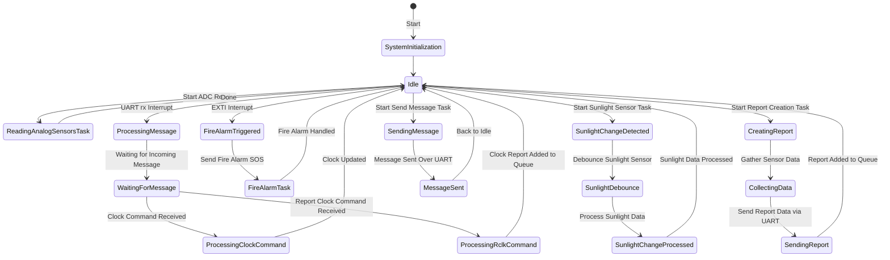

# Dormammu
# 🌤️ Weather Station with Real-Time Monitoring
Welcome to the Weather Station project! This system utilizes the STM32F103T8 microcontroller and FreeRTOS to create a weather monitoring system capable of real-time data acquisition and display. The system integrates sensors for temperature, humidity, and other environmental parameters, and it outputs data via UART for visualization.

## 🍄 Features
- Real-time Data Collection: Collect environmental data from various sensors, including temperature, humidity, and precipitation.
- Sensor Integration: Utilize sensors like LM35 (temperature), FC28 (humidity), and YL-83 (water level) to gather environmental information.
- PWM Control: Adjust PWM duty cycle on an LED output (simulated motor/fan) based on temperature changes.
- FreeRTOS: Multi-threaded design to handle sensor readings, system updates, and display refreshes concurrently.
## 🌞Hardware
- Microcontroller: STM32F103T8 (using FreeRTOS and OpenLibCM3)
- Sensors:
  - LM35: Analog temperature sensor.
  - FC28: Soil moisture and humidity sensor.
  - YL-83: Water level sensor.
  - QS-FS Anemometer: Simulated with a potentiometer due to budget and availability. Analog output proportional to wind speed.
- PWM Control: Adjust LED brightness based on temperature.
- UART Communication: Sends system data over serial (UART) for visualization.
- I2C : Display data on an external screen using I2C (not implemented, I tried 
).
# 🗽 State Machine Diagram

## ☢️ Meet the team
- It's just [me](https://github.com/fnc8822) 😇

## 👾 General Notes on Codebase
Code isn't as modular or feature intense as I would've liked, but does mantain project structure with the following key files:
- main.c: Entryway to the project, calls a few functions and stays in a loop
- firmware.h: Header with all definitions, inclusions and most documentation
- firmware.c: File where all the logic is handled, it's at least segmented by function / task for easier navigation.
For detailed, generated documentation, check doxygen documentation.

## 📐 Setup and Installation
You can follow the fresh [INSTALL.md](https://github.com/ICOMP-UNC/Dormammu/blob/cleanup/INSTALL.md)
